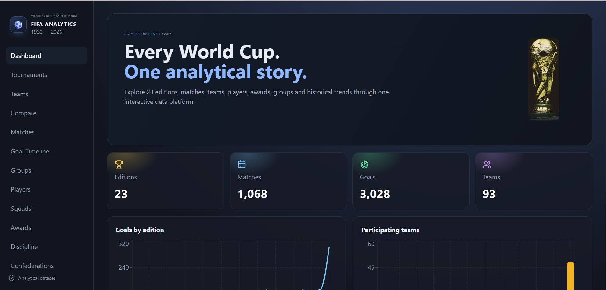
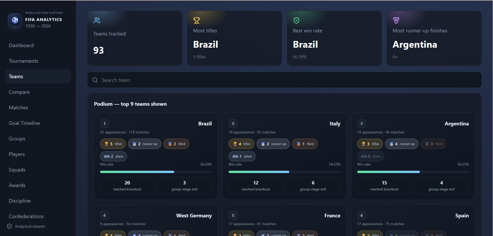
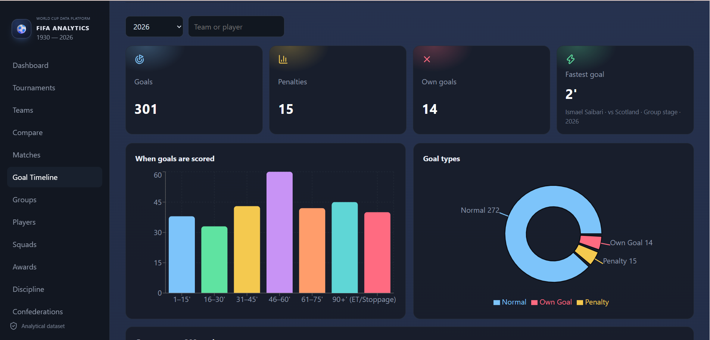
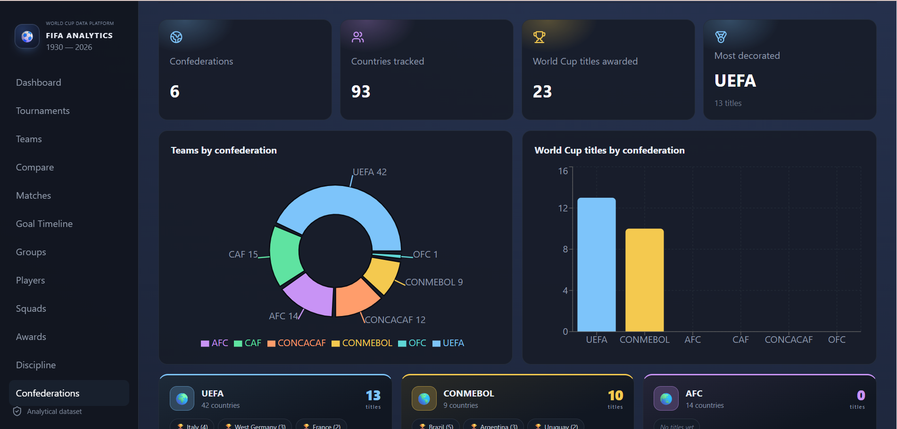
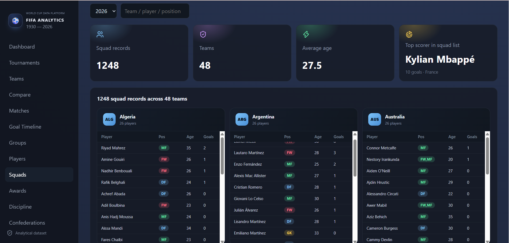

<div align="center">

# ⚽ FIFA World Cup Analytics
### *A complete history of the World Cup, 1930 → 2026 — in one dashboard*

**[🔴 Live Demo → fifa-analysis-egjlu17bp-santanu4.vercel.app](https://fifa-analysis-egjlu17bp-santanu4.vercel.app/)**


</div>

---

## 🖼️ Screenshots

<table>
<tr>
<td width="50%"><p align="center"><b>Dashboard</b></p></td>
<td width="50%"><p align="center"><b>Teams — all-time podium</b></p></td>
</tr>
<tr>
<td width="50%"><p align="center"><b>Goal Timeline</b></p></td>
<td width="50%"><p align="center"><b>Confederations</b></p></td>
</tr>
<tr>
<td colspan="2"><p align="center"><b>Squads</b></p></td>
</tr>
</table>

---

## 📖 About

Every FIFA World Cup ever played — **23 editions, 1,068 matches, 3,000+ goals, 12,000+ squad
records** — cleaned, cross-verified, and turned into an interactive analytics platform.
An end-to-end pipeline (raw → cleaned → validated → analytics-ready) feeds a FastAPI REST
API, with a PostgreSQL-ready schema for anyone who wants to move it off CSVs, and a
responsive React/Vite dashboard on top.

## ✨ Features

| Page | What it shows |
|---|---|
| 🏠 **Dashboard** | Headline stats + goals/teams trend across every edition |
| 🏆 **Tournaments** | Every edition's host, podium, format & stats — searchable |
| 🌍 **Teams** | All-time podium (🥇🥈🥉) + full searchable team stat table |
| ⚔️ **Compare** | Head-to-head record between any two nations |
| ⚽ **Matches** | Every match ever played, filterable by year or team, plus an "All Editions" career view |
| 🎯 **Goal Timeline** | Goal-by-goal record (1930–2026) — minute-of-match & goal-type breakdowns |
| 📊 **Groups** | Full group-stage standings for every edition |
| 🧑‍💼 **Players** | All-time top scorers, assist leaders & single-tournament records |
| 👕 **Squads** | Full squad lists for every edition |
| 🏅 **Awards** | Golden Ball, Golden Boot & Golden Glove — every edition |
| 🟨 **Discipline** | Cards by round & by team, for any edition |
| 🌐 **Confederations** | Team directory + titles-by-confederation visualization |

## 🛠️ Tech Stack

**Data** — Python, Pandas, NumPy · **API** — FastAPI (PostgreSQL-ready schema) · **Frontend** — React, Vite, Recharts · **Ops** — Docker, Git/GitHub

*(the live app runs straight off cleaned CSVs — no database required; Postgres is an optional upgrade path, see [`docs/ARCHITECTURE.md`](docs/ARCHITECTURE.md))*

## 📁 Project Structure

```
fifa-app/
├── backend/                 # FastAPI app
│   └── app/main.py          #   → all REST endpoints
├── frontend/                # React + Vite app
│   └── src/
│       ├── main.jsx         #   → every page/component
│       └── style.css        #   → design system
├── data/
│   ├── raw/                 # original source CSVs (immutable)
│   └── processed/           # cleaned, validated, analytics-ready datasets
├── scripts/                 # data audit → clean → validate → generate pipeline
├── database/                # optional Postgres schema + seed
├── docs/                    # architecture notes & screenshots
├── run.py / run.bat         # one-command local launcher
└── docker-compose.yml       # containerized setup
```

## 🚀 Getting Started

Requires **Python 3.12+** and **Node.js 18+**.

### ⚡ Quick start (recommended)
```bash
python run.py          # macOS/Linux/Windows
# or just double-click run.bat on Windows
```
This starts the backend **and** frontend together and prints one URL:
```text
Website:   http://localhost:5173
```
💡 Ctrl+Click that link in your terminal to jump straight into the dashboard — the Vite
dev server proxies `/api` calls to FastAPI automatically, so this one URL is all you need.

<details>
<summary><b>Manual setup</b> (click to expand)</summary>

**1 — Data pipeline** *(optional — processed data is already included)*
```bash
python scripts/data_audit.py
python scripts/clean_data.py
python scripts/validate_data.py
python scripts/generate_analytics.py
```

**2 — Backend**
```bash
cd backend
python -m venv .venv && source .venv/bin/activate   # Windows: .venv\Scripts\activate
pip install -r requirements.txt
uvicorn app.main:app --reload --port 8000
```
API docs live at `http://localhost:8000/docs`

**3 — Frontend**
```bash
cd frontend
npm install
npm run dev
```
Set `VITE_API_URL` if the API isn't at the default `http://localhost:8000/api`.

</details>

### 🐳 Docker
```bash
docker compose up --build
```

## 📤 Push to GitHub
```bash
git init
git add .
git commit -m "Build FIFA World Cup analytics platform"
git branch -M main
git remote add origin YOUR_GITHUB_REPOSITORY
git push -u origin main
```

## 🌐 Deployment

| | |
|---|---|
| **Frontend** | Vercel → [fifa-analysis-egjlu17bp-santanu4.vercel.app](https://fifa-analysis-egjlu17bp-santanu4.vercel.app/) |
| **Backend** | Render (FastAPI) |

Deploying elsewhere? Ship the frontend as a static Vite build and the backend as any
Python web service, then point the frontend's `VITE_API_URL` at your backend's public
`/api` base URL.

## 🗃️ Data Note

Raw CSVs in `data/raw/` are kept immutable — the pipeline never overwrites source data.
Cleaned and derived datasets are published separately in `data/processed/`.

---

<div align="center">

Made with ⚽, 📊 and a lot of World Cup trivia.

</div>
